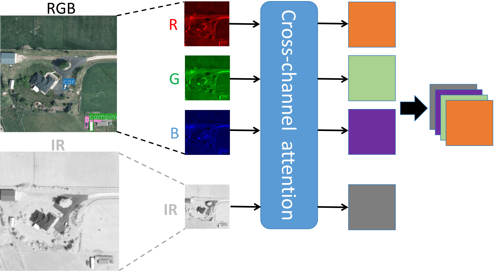

# Multi-modal object detection in aerial images using transformers


Dataset: VEDAI dataset https://pan.baidu.com/s/1L0SWi5AQA6ZK9jDIWRY7Fg

Make sure to run dat_transform.py (https://github.com/Bissmella/SuperYolo/blob/main/data_transform.py) on the dataset before training. Change the PATH to your dataset directory path.

# FCT
This repo contains the official PyTorch implementation for the ICIP 2024 paper: 'Multimodal transformer using cross-channel attention for object detection in remote sensing images'  ([paper](https://arxiv.org/pdf/2310.13876)).

<div align="center"></div>

## Brief Introduction

- Cross-channel attention fuses multi-sensory data (RGB, IR) using cross-attention while taking into account two channels at a time. The fused output of cross-channel attention is then used for object detection.
- SWIN backbone is used but enhanced with convolutional layer in non-shifting block which acts as an additional support to the SWIN's shifting mechanism.
- The proposed model consists of cross-channel attention, enhanced SWIN-like backbone, and yolo-5 based detection head.


## Data Preparation

- We train and evaluate our model on VEDAI dataset which includes aerial images of two RGB and IR channels. The VEDAI dataset can be downloaded from ([here.](https://pan.baidu.com/s/1L0SWi5AQA6ZK9jDIWRY7Fg))
- Please prepare the original VEDAI dataset using the 'data_transform.py' file.


## Citation
If you find the idea useful or inspiring, please consider citing:
```
@article{bahaduri2023multimodal,
  title={Multimodal Transformer Using Cross-Channel attention for Object Detection in Remote Sensing Images},
  author={Bahaduri, Bissmella and Ming, Zuheng and Feng, Fangchen and Mokraou, Anissa},
  journal={arXiv preprint arXiv:2310.13876},
  year={2023}
}
```


## Acknowledgement

Our code is heavily based on previous works, including [SuperYOLO](https://github.com/icey-zhang/SuperYOLO) and [YOLOv5](https://github.com/ultralytics/yolov5) thanks to their authors open-sourcing their implementation codes!